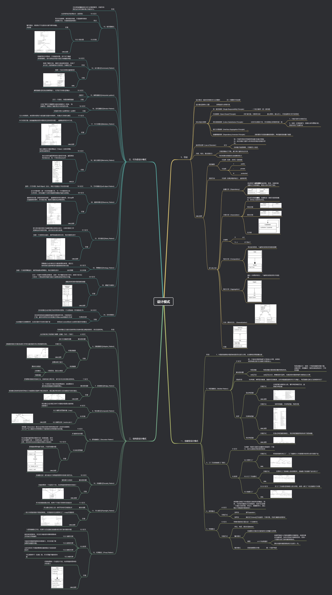

# **[Design_Patterns_in_Modern_Cpp_20](https://github.com/AidenYuanDev/design_patterns_in_modern_Cpp_20)**

Registro de los problemas encontrados durante el estudio de «C++20 Patrones de Diseño: Métodos reutilizables de diseño orientado a objetos».

Puede optar por hacer clic en cada directorio del `GitHub` por capítulo para ver las explicaciones, o bien consultar los siguientes enlaces.

**Creacionales**

[Reflexiones sobre el patrón Constructor (Builder) en C++ (Comparación con «C++20 Patrones de Diseño» y patrones de diseño convencionales)](https://blog.csdn.net/Ten_years_star/article/details/139773063)

[Reflexiones sobre el patrón Fábrica en C++ (Comparación con «C++20 Patrones de Diseño» y patrones de diseño convencionales)](https://blog.csdn.net/Ten_years_star/article/details/140105585)

[Patrón Prototipo en «C++20 Patrones de Diseño»](https://blog.csdn.net/Ten_years_star/article/details/140126331)

[Patrón Singleton en «C++20 Patrones de Diseño»](https://blog.csdn.net/Ten_years_star/article/details/140133367)

**Estructurales**

[Compartiendo experiencias sobre el patrón Adaptador en «C++20 Patrones de Diseño»](https://blog.csdn.net/Ten_years_star/article/details/140137673)

[Compartiendo experiencias sobre el patrón Puente en «C++20 Patrones de Diseño»](https://blog.csdn.net/Ten_years_star/article/details/140152387)

[Patrón Compuesto en «C++20 Patrones de Diseño»](https://blog.csdn.net/Ten_years_star/article/details/140155850)

[Patrón Decorador en «C++20 Patrones de Diseño»](https://blog.csdn.net/Ten_years_star/article/details/140163682)

[Patrón Peso Ligero en «C++20 Patrones de Diseño»](https://blog.csdn.net/Ten_years_star/article/details/140171982)

[Patrón Fachada en «C++20 Patrones de Diseño»](https://blog.csdn.net/Ten_years_star/article/details/140164190)

[Patrón Proxy en «C++20 Patrones de Diseño»](https://blog.csdn.net/Ten_years_star/article/details/140180135)

**De Comportamiento**

[Patrón Cadena de Responsabilidad en «C++20 Patrones de Diseño»](https://blog.csdn.net/Ten_years_star/article/details/140182297)

[Reflexiones sobre el patrón Comando en «C++20 Patrones de Diseño»](https://blog.csdn.net/Ten_years_star/article/details/140192027)

[Implementación manual del patrón Mediador en «C++20 Patrones de Diseño»](https://blog.csdn.net/Ten_years_star/article/details/140211882)

[Patrón Memento en «C++20 Patrones de Diseño»](https://blog.csdn.net/Ten_years_star/article/details/140224948)

[Implementación manual del patrón Mediador en «C++20 Patrones de Diseño»](https://blog.csdn.net/Ten_years_star/article/details/140211882)

[Patrón Memento en «C++20 Patrones de Diseño»](https://blog.csdn.net/Ten_years_star/article/details/140224948)

[Patrón Objeto Nulo en «C++20 Patrones de Diseño»](https://blog.csdn.net/Ten_years_star/article/details/140229123)

[Patrón Observador en «C++20 Patrones de Diseño»](https://blog.csdn.net/Ten_years_star/article/details/140273451)

[Patrón Estado en «C++ Patrones de Diseño»](https://blog.csdn.net/Ten_years_star/article/details/140286269)

[Patrón Estrategia en «C++20 Patrones de Diseño»](https://blog.csdn.net/Ten_years_star/article/details/140287128)

[Patrón Método Plantilla en «C++20 Patrones de Diseño»](https://blog.csdn.net/Ten_years_star/article/details/140300246?spm=1001.2014.3001.5501)

[Patrón Visitante en «C++20 Patrones de Diseño»](https://blog.csdn.net/Ten_years_star/article/details/140307638?spm=1001.2014.3001.5501)

Mi mapa conceptual

